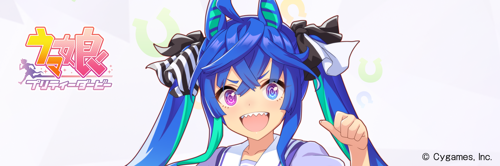

I watched the anime [Uma Musume Pretty Derby Season 2](https://anime-umamusume.jp/) and cried a lot, so I'll leave you with my story.

<!--more-->

Please note that this article contains spoilers.

# Introduction

I'm an anime otaku with no interest in horse racing or social-network games. 
I respect all animators.
 I would like to have a collection of the original drawings when I can afford it.

Recently, my hobby has been to move the cross trainer at the gym while watching compound MADs on YouTube.
I was interested in seeing how passionate this anime is because I saw a part of Uma Musume's race scene.

# Reasons why I'm impressed

## The quality of the animation is excellent

First of all, the objective fact is that the quality of the animation is excellent.

It's stable overall, and it shows us what we need to see.
The race scene and the winning live scene are awe-inspiring.
When I first saw the last scene of the first episode, it was so cool that my voice leaked out (I'm glad my family wasn't around).
The raging development in the second half is the best.
The last episode was beyond description.

This is probably the key to Uma Musume, but the script is basically based on historical facts.
There are even parts that are based on actual situations and commentaries.
After watching the anime

- Watch actual race videos on YouTube, etc.
- Look up the historical facts on Wikipedia, etc.

and cry again. (If you play the social-network game, you can enjoy it even more!)

Even more impressive is that the touching historical facts become even more heartbreaking by adding the creative interaction between the Uma Musumes without contradiction.
The scene in episode 10 where Tokai Teio withdraws her retirement after seeing Twin Turbo's "escape drama" is a real highlight (it makes me cry no matter how many times I watch it).
I was shocked to learn that Twin Turbo and Tokai Teio had no connection in history (and I cried again).
The animation staff is genuinely talented.

## I put my own circumstances on top of the character

When I was a student, I didn't particularly like running. 
Still, after I became an adult, I discovered the joy of jogging (I was an industrial researcher at the time, and for some reason, there are many joggers runners in research jobs).
I was attracted by the fact that I didn't have to think about anything while I was running, and the beer tasted so good afterward.
However, after a certain amount of jogging, I realized something. Everything tastes better after a run.
After that, running became my hobby, both indoors and outdoors.

There was a time when I ran every day until my child was born.
Even after the birth of my child, I was running more than 5km 2 to 3 times a week.
My dream was to participate in a marathon with my child.

However, since the beginning of this year, I started to feel numbness in the little finger of my left hand during the exercise.
I went to see a doctor to be sure, and he told me that I had a [cervical disc herniation](https://www.spine-health.com/conditions/herniated-disc/cervical-herniated-disc-symptoms-and-treatment-options).
The cause seems to be that the bones in my neck are congenitally slightly bent.
It's one more thing I can't tell my parents.

It's not serious since I'm able to live everyday life. 
Still, to prevent the progression of the disease, I should avoid any exercise that puts strain on my neck.
For example, running and jumping are not allowed.
Bicycling is also not recommended because the forward-leaning posture puts a lot of strain on the neck (which is frustrating because one of my dreams was to participate in a triathlon).
I was lucky to be told that cross-training at the gym would be no problem.

It was an unexpected turn of events that tied up my life.
To be honest, I was shocked because I thought I was still young.
However, I was grateful to give up on it as an unavoidable forced event because of the congenital hernia.
If it had been caused by an acquired condition, I would have regretted it for the rest of my life.

In such a situation
I came across [Uma Musume Pretty Derby](https://anime-umamusume.jp/).
I understand that what "running" means to me and to racehorses are two very different things.
Nevertheless, every time I saw them being deprived of "running" in the anime, I felt as if my heart was being torn out.
And when I saw them overcome their breakdowns and win races, it gave me great courage.
I've heard that racehorses run on dreams, and that's precisely what they do.

# Conclusion

Uma Musume is the best! Master Twin Turbo is the best!

I'd like to do data analysis of racehorses soon.
