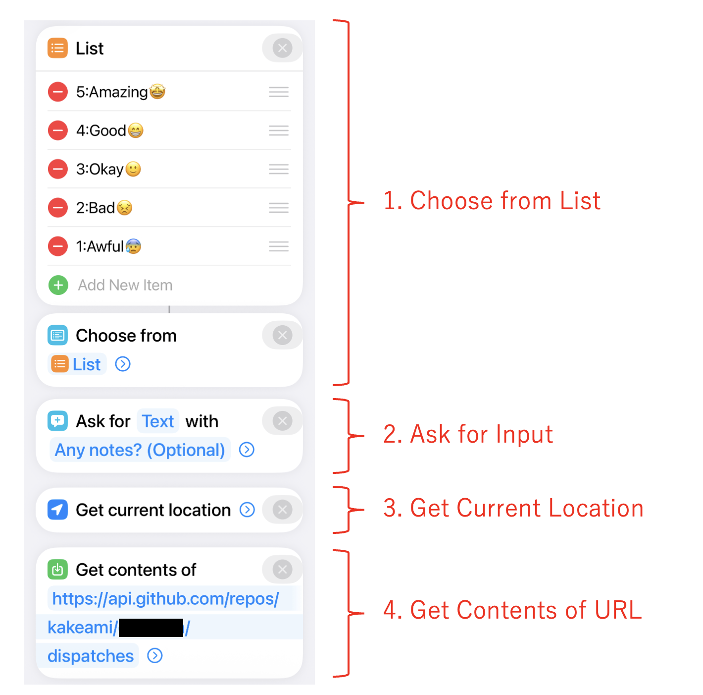
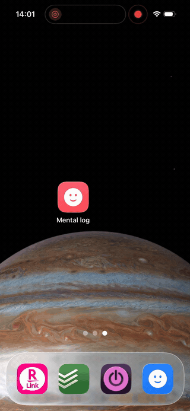

## Introduction

Over the past 8 months, I've recorded **5,363 mood entries** across **242 consecutive days** — a 100% recording rate, averaging about 22 entries per day. Each entry captures a 1–5 mood score, a short memo, and my GPS coordinates at the moment of logging.

| Metric | Value |
|--------|-------|
| Period | Jul 15, 2025 – Mar 13, 2026 (242 days) |
| Total entries | 5,363 |
| Days recorded | 242 (100% rate) |
| Avg entries/day | ~22 |
| Mean score | 4.13 / 5 |

The system that made this possible costs nothing, requires no app development, and runs entirely on two things most developers already have: an **iPhone** and a **GitHub account**.

Most mood tracking apps fail the same way — after the initial excitement fades, the friction of opening an app, navigating to the right screen, and filling out a form kills the habit within weeks. I wanted something that could be triggered in a single tap from my home screen, with zero load time. The solution: an **iPhone Shortcut** that fires a `repository_dispatch` event to **GitHub Actions**, which appends a line to a **JSONL file** and commits it. That's the entire system.

## Why This Architecture

### Requirements

Before building anything, I defined what I actually needed:

1. **One-tap recording** — No app to open, no screen to navigate. Tap → input → done.
2. **Zero cost** — No paid services, no cloud infrastructure to manage.
3. **Structured data** — Machine-readable from day one. No parsing diary entries after the fact.
4. **Data ownership** — Everything lives in a Git repo I control. No vendor lock-in.
5. **LLM-friendly** — The data format should be trivially consumable by language models.

### `repository_dispatch` vs `workflow_dispatch`

GitHub Actions offers two main ways to trigger workflows via API:

| Trigger | Characteristics | iPhone Shortcut compatibility |
|---------|----------------|-------------------------------|
| `workflow_dispatch` | Designed for GitHub UI / CLI. Inputs must be pre-defined in YAML. | Possible (with PAT), but requires workflow ID lookup |
| `repository_dispatch` | Fires on any HTTP POST. Accepts arbitrary JSON via `client_payload`. | **Excellent** — just POST to one endpoint |

`repository_dispatch` wins because `client_payload` lets you send whatever JSON you want. No schema to declare in advance, no workflow ID to look up. The iPhone Shortcut just needs to know the repo URL and a `event_type` string.

### Why JSONL

**JSONL** (JSON Lines) — one JSON object per line — turned out to be the perfect format for this use case:

- **Append-only** — Each workflow run just echoes one line to the end of a file. No parsing, no rewriting.
- **Git-diffable** — Each commit adds exactly one line. Diffs are clean and meaningful.
- **LLM-friendly** — Feed it directly to `jq` or pipe it into an LLM. No preprocessing needed.
- **Schema-flexible** — Different log types can have different fields without a migration.

### Free Tier Math

GitHub Actions gives private repos **2,000 minutes/month** on the free tier. Each log entry takes about 20–30 seconds of workflow time. Even at 22 entries/day × 30 days = 660 runs × 0.5 min = **~330 minutes/month**. That's well within budget, with room for 5x growth.

### Architecture Overview

```
iPhone Shortcut
    │
    ▼  POST /repos/{owner}/{repo}/dispatches
GitHub API
    │
    ▼  repository_dispatch event
GitHub Actions
    │
    ├── jq: build JSON line
    ├── echo >> file.jsonl
    ├── git commit
    └── git push
```

## How It Works

### The GitHub Actions Workflow

Here's the full workflow for the mental health log (`.github/workflows/mental_log.yml`):

```yaml
name: Add Mental Health Log

# Queue concurrent runs — don't cancel, just wait
concurrency:
  group: repo-write-${{ github.repository }}
  cancel-in-progress: false

on:
  repository_dispatch:
    types: [add_mental_log]

jobs:
  create_log_file:
    runs-on: ubuntu-latest
    steps:
      - name: Checkout repository
        uses: actions/checkout@v4
        with:
          token: ${{ secrets.ACCESS_TOKEN }}

      - name: Append Log to JSONL File
        env:
          LANG: C.UTF-8
          SCORE_RAW: ${{ github.event.client_payload.score }}
          MEMO: ${{ github.event.client_payload.memo }}
          LATITUDE: ${{ github.event.client_payload.latitude }}
          LONGITUDE: ${{ github.event.client_payload.longitude }}
          ADDRESS_RAW: ${{ github.event.client_payload.address }}
        run: |
          # Generate JST timestamps (runner is UTC)
          JST_ISO_TIMESTAMP=$(TZ=Asia/Tokyo date --iso-8601=seconds)
          JST_DATE_YMD=$(TZ=Asia/Tokyo date +'%Y-%m-%d')
          JST_DATE_YM=$(TZ=Asia/Tokyo date +'%Y-%m')
          FILE_PATH="sync/Mental/${JST_DATE_YM}/${JST_DATE_YMD}-mental.jsonl"
          mkdir -p "$(dirname "${FILE_PATH}")"

          # Clean up iPhone location newlines, extract numeric score
          ADDRESS=$(echo "${ADDRESS_RAW}" | tr -d '\n\r')
          SCORE_NUMBER=$(echo "${SCORE_RAW}" | cut -d ':' -f 1)

          # Build JSON safely with jq (--arg for strings, --argjson for numbers/null)
          JSON_LINE=$(jq -c -n \
            --arg timestamp "${JST_ISO_TIMESTAMP}" \
            --argjson score "${SCORE_NUMBER:-null}" \
            --arg memo "${MEMO}" \
            --argjson latitude "${LATITUDE:-null}" \
            --argjson longitude "${LONGITUDE:-null}" \
            --arg address "${ADDRESS}" \
            '{timestamp: $timestamp, score: $score, memo: $memo,
              location: {latitude: $latitude, longitude: $longitude,
                         address: $address}}')

          echo "${JSON_LINE}" >> "${FILE_PATH}"

          git config --global user.name 'github-actions[bot]'
          git config --global user.email \
            'github-actions[bot]@users.noreply.github.com'
          git add "${FILE_PATH}"
          git commit -m "🧠 Add mental log at $(TZ=Asia/Tokyo date +'%H:%M:%S')"

          # Rebase to handle concurrent pushes
          git pull --rebase origin master || true
          git push
```

A few things worth noting:

- **Concurrency control**: The `concurrency` block queues workflow runs instead of canceling them. If two mood logs arrive 10 seconds apart, the second waits for the first to finish. The `git pull --rebase` is a safety net for the rare case where two runs overlap despite queuing.
- **`jq` for JSON generation**: Never build JSON with string concatenation in shell scripts. `jq -n` with `--arg` (strings) and `--argjson` (numbers, null) handles escaping correctly.
- **Score parsing**: The iPhone Shortcut sends scores as `"4:Good😁"`. `cut -d ':' -f 1` extracts just the number.
- **Timezone handling**: The runner is UTC. Every `date` call explicitly sets `TZ=Asia/Tokyo` for JST timestamps and file paths.

### The iPhone Shortcut

**Prerequisites**: Create a [fine-grained Personal Access Token](https://github.com/settings/tokens?type=beta) with `Contents: Read and write` permission scoped to your lifelog repository.

The Shortcut has just 4 steps:

1. **Choose from List** — Select a mood score (`5:Amazing😆`, `4:Good😁`, `3:Okay😐`, `2:Low😣`, `1:Awful😫`)
2. **Ask for Input** (text) — Optional memo about what you're doing/feeling
3. **Get Current Location** — Captures GPS coordinates and street address
4. **Get Contents of URL** — POST to GitHub API

{fig-align="center"}

The API call:

- **URL**: `https://api.github.com/repos/{owner}/{repo}/dispatches`
- **Method**: POST
- **Headers**: `Authorization: token {PAT}`, `Accept: application/vnd.github.v3+json`
- **Body**:

```json
{
  "event_type": "add_mental_log",
  "client_payload": {
    "score": "(selected score)",
    "memo": "(input text)",
    "latitude": "(current latitude)",
    "longitude": "(current longitude)",
    "address": "(current address)"
  }
}
```

{width=300 fig-align="center"}

### Sample JSONL Output

Each workflow run appends one line like this:

```jsonl
{"timestamp":"2026-01-15T08:30:12+09:00","score":4,"memo":"Beautiful morning, clear sky","location":{"latitude":35.6812,"longitude":139.7671,"address":"Marunouchi 1-chome, Chiyoda, Tokyo"}}
{"timestamp":"2026-01-15T12:45:33+09:00","score":3,"memo":"Post-lunch drowsiness hitting hard","location":{"latitude":35.6812,"longitude":139.7671,"address":"Marunouchi 1-chome, Chiyoda, Tokyo"}}
{"timestamp":"2026-01-15T18:20:05+09:00","score":5,"memo":"Project milestone reached","location":{"latitude":35.6580,"longitude":139.7016,"address":"Dogenzaka 1-chome, Shibuya, Tokyo"}}
```

### Extending to Other Log Types

The same architecture scales to any type of structured logging. I currently run five:

| Log type | `event_type` | File split | Unique fields |
|----------|-------------|------------|---------------|
| Mental | `add_mental_log` | Daily | `score` |
| Food | `add_food_log` | Daily | `item`, `score`, `quantity`, `unit` |
| Exercise | `add_exercise_log` | Monthly | `activity_type`, `effort_quantity`, `effort_unit`, `score` |
| Weight | `add_weight_log` | Monthly | `weight_kg` |
| Breathing | `add_breath_log` | Daily | `breath_count` |

Each log type is a separate workflow file, a separate iPhone Shortcut, and a separate directory tree. The pattern is identical — only the fields change.

### File Splitting Strategy

| Split by | Best for | Example |
|----------|----------|---------|
| Day | High-frequency logs (~10+ entries/day) | Mental (~22/day), Food (~13/day) |
| Month | Low-frequency logs (0–1 entries/day) | Exercise, Weight, Breathing |

Daily splitting keeps individual files small and makes date-range queries with `cat` or `jq` straightforward.

## Analyzing 8 Months of Data

With 5,363 entries accumulated, let's see what the data reveals. All charts below are interactive — hover for details, zoom, and pan.

```{python}
#| echo: false
#| output: false

# data/mental.jsonl is .gitignore'd (contains real mood log data)
# Charts are cached via Quarto's freeze mechanism

import json
from pathlib import Path
from datetime import datetime, timedelta

import pandas as pd
import numpy as np
import plotly.express as px
import plotly.graph_objects as go

DATA_PATH = Path("data/mental.jsonl")

entries = []
for line in DATA_PATH.read_text(encoding="utf-8").splitlines():
    if line.strip():
        entries.append(json.loads(line.strip()))

df = pd.DataFrame(entries)
df["timestamp"] = pd.to_datetime(df["timestamp"])
df["date"] = df["timestamp"].dt.date
df["hour"] = df["timestamp"].dt.hour
df["dow"] = df["timestamp"].dt.dayofweek  # 0=Mon, 6=Sun
df["dow_name"] = df["timestamp"].dt.strftime("%a")  # Mon, Tue, ...
df["year_month"] = df["timestamp"].dt.to_period("M").astype(str)

SCORE_LABELS = {5: "Amazing", 4: "Good", 3: "Okay", 2: "Low", 1: "Awful"}
SCORE_COLORS = {5: "#fde725", 4: "#6cce5a", 3: "#1f9e89", 2: "#31688e", 1: "#440154"}

TEMPLATE = "plotly_white"

# Summary stats
n_entries = len(df)
n_days = df["date"].nunique()
date_min = df["date"].min()
date_max = df["date"].max()
total_span = (date_max - date_min).days + 1
recording_rate = n_days / total_span * 100
avg_per_day = n_entries / n_days
mean_score = df["score"].mean()
```

### Score Distribution

The first thing to check: how are mood scores distributed?

```{python}
fig_hist = px.histogram(
    df,
    x="score",
    color="score",
    color_discrete_map={str(k): v for k, v in SCORE_COLORS.items()},
    category_orders={"score": [1, 2, 3, 4, 5]},
    template=TEMPLATE,
    title="Mood Score Distribution (n=5,363)",
    labels={"score": "Score", "count": "Count"},
)
fig_hist.update_layout(
    xaxis=dict(
        tickvals=[1, 2, 3, 4, 5],
        ticktext=[f"{k}: {SCORE_LABELS[k]}" for k in [1, 2, 3, 4, 5]],
    ),
    showlegend=False,
    bargap=0.1,
)
fig_hist.show()
```

The distribution is heavily skewed toward 4 ("Good") and 5 ("Amazing"), with a mean of 4.13. Scores of 1 ("Awful") are rare — which is reassuring, though it does raise questions about whether I'm being honest or just optimistic. My take: the system captures *micro-moments*, not deep reflections. A quick "things are fine" naturally lands at 4.

### All 5,363 Entries Over Time

The strip chart shows every single entry as a dot, plotted over the full 8-month period. This is the raw data — no aggregation.

```{python}
# Add jitter for visibility
rng = np.random.RandomState(42)
df["score_jitter"] = df["score"] + rng.uniform(-0.3, 0.3, size=len(df))

fig_strip = px.scatter(
    df,
    x="timestamp",
    y="score_jitter",
    color="score",
    color_discrete_map={str(k): v for k, v in SCORE_COLORS.items()},
    category_orders={"score": [1, 2, 3, 4, 5]},
    template=TEMPLATE,
    title="All 5,363 Mood Entries (Jul 2025 – Mar 2026)",
    labels={"timestamp": "", "score_jitter": "Score"},
    opacity=0.5,
)
fig_strip.update_layout(
    yaxis=dict(
        tickvals=[1, 2, 3, 4, 5],
        ticktext=[f"{k}: {SCORE_LABELS[k]}" for k in [1, 2, 3, 4, 5]],
    ),
    showlegend=False,
)
fig_strip.update_traces(marker=dict(size=4))
fig_strip.show()
```

The density of dots tells its own story. You can see recording intensity is fairly consistent — I rarely missed a day. There's a visible cluster of lower scores in December, which lines up with end-of-year stress. The recovery into January is equally clear.

### Daily Average with 7-Day Moving Average

Aggregating to daily averages smooths out the noise and reveals the trend.

```{python}
daily = df.groupby("date")["score"].mean().reset_index()
daily.columns = ["date", "avg_score"]
daily["date"] = pd.to_datetime(daily["date"])
daily = daily.sort_values("date")
daily["ma7"] = daily["avg_score"].rolling(window=7, min_periods=1).mean()

fig_trend = go.Figure()
fig_trend.add_trace(
    go.Scatter(
        x=daily["date"],
        y=daily["avg_score"],
        mode="markers",
        name="Daily avg",
        marker=dict(color="#31688e", size=4, opacity=0.5),
    )
)
fig_trend.add_trace(
    go.Scatter(
        x=daily["date"],
        y=daily["ma7"],
        mode="lines",
        name="7-day MA",
        line=dict(color="#fde725", width=3),
    )
)
fig_trend.update_layout(
    template=TEMPLATE,
    title="Daily Average Score with 7-Day Moving Average",
    xaxis_title="",
    yaxis_title="Score",
    yaxis=dict(range=[1, 5.2]),
    legend=dict(orientation="h", yanchor="bottom", y=1.02, xanchor="right", x=1),
)
fig_trend.show()
```

The 7-day moving average hovers around 4.0–4.3 for most of the period. The December dip is clearly visible — dropping to about 3.6 before bouncing back. There's also a slight upward trend in recent months, possibly from the habit itself becoming a source of mindfulness.

### Hour × Day-of-Week Heatmap

This is the chart I find most useful — it shows when I feel best and worst.

```{python}
DOW_ORDER = ["Mon", "Tue", "Wed", "Thu", "Fri", "Sat", "Sun"]

pivot = df.groupby(["hour", "dow_name"])["score"].mean().reset_index()
pivot_table = pivot.pivot(index="dow_name", columns="hour", values="score")
pivot_table = pivot_table.reindex(DOW_ORDER)

fig_heatmap = go.Figure(
    data=go.Heatmap(
        z=pivot_table.values,
        x=[f"{h}:00" for h in pivot_table.columns],
        y=pivot_table.index,
        colorscale="Viridis",
        zmin=1,
        zmax=5,
        colorbar=dict(title="Avg Score", tickvals=[1, 2, 3, 4, 5]),
        hovertemplate="Hour: %{x}<br>Day: %{y}<br>Score: %{z:.2f}<extra></extra>",
    )
)
fig_heatmap.update_layout(
    template=TEMPLATE,
    title="Average Mood Score by Hour and Day of Week",
    xaxis_title="Hour",
    yaxis_title="",
    yaxis=dict(autorange="reversed"),
)
fig_heatmap.show()
```

```{python}
#| echo: false
#| output: false

# OG image: enlarged version of the heatmap for social media preview
fig_og = go.Figure(fig_heatmap)
fig_og.update_layout(
    title=dict(text="Average Mood Score by Hour and Day of Week", font=dict(size=28)),
    font=dict(size=18),
    margin=dict(l=80, r=40, t=80, b=60),
    width=1200,
    height=630,
)
fig_og.write_image("og-image.png", width=1200, height=630)
```

The patterns are striking:

- **Late night / early morning (2–6 AM) is the low point.** Friday and Saturday nights dip to around 2.7 — unsurprisingly, nothing good happens when you're awake at 3 AM.
- **Evenings (21–23 PM) are consistently high** — averaging 4.2–4.5 regardless of the day. This is my wind-down time, and it shows.
- **Weekday mornings** are slightly lower than weekend mornings, suggesting the Monday-through-Friday routine carries a small but measurable mood cost.
- **Wednesday afternoons** are a consistent bright spot — possibly a mid-week relief effect.

### Recording Calendar

A GitHub-style contribution calendar showing how many entries I logged each day.

```{python}
# Build calendar data
cal_daily = df.groupby("date").size().reset_index(name="count")
cal_daily["date"] = pd.to_datetime(cal_daily["date"])

# Fill missing dates with 0
all_dates = pd.date_range(start=cal_daily["date"].min(), end=cal_daily["date"].max())
cal_daily = cal_daily.set_index("date").reindex(all_dates, fill_value=0).reset_index()
cal_daily.columns = ["date", "count"]

cal_daily["dow"] = cal_daily["date"].dt.dayofweek  # 0=Mon
cal_daily["week"] = (
    (cal_daily["date"] - cal_daily["date"].min()).dt.days + cal_daily["date"].min().dayofweek
) // 7

DOW_LABELS = ["Mon", "Tue", "Wed", "Thu", "Fri", "Sat", "Sun"]

# Week labels: show month name at the first week of each month
week_dates = cal_daily.groupby("week")["date"].min()
week_labels = []
seen_months = set()
for w in sorted(week_dates.index):
    d = week_dates[w]
    month_key = (d.year, d.month)
    if month_key not in seen_months:
        seen_months.add(month_key)
        week_labels.append(d.strftime("%b %Y"))
    else:
        week_labels.append("")

fig_cal = go.Figure(
    data=go.Heatmap(
        z=cal_daily.pivot(index="dow", columns="week", values="count").reindex(range(7)).values,
        x=week_labels,
        y=DOW_LABELS,
        colorscale=[
            [0, "#ebedf0"],
            [0.01, "#c6e48b"],
            [0.33, "#7bc96f"],
            [0.66, "#239a3b"],
            [1.0, "#196127"],
        ],
        zmin=0,
        zmax=cal_daily["count"].quantile(0.95),
        colorbar=dict(title="Entries"),
        hovertemplate="Day: %{y}<br>Entries: %{z}<extra></extra>",
    )
)
fig_cal.update_layout(
    template=TEMPLATE,
    title="Recording Frequency Calendar",
    xaxis=dict(side="top", tickangle=-45),
    yaxis=dict(autorange="reversed"),
    height=250,
)
fig_cal.show()
```

The calendar confirms the 100% recording rate — there are no empty cells in the 242-day span. The intensity variation shows that some days had 30+ entries (darker green) while others had only a handful, but every single day has at least one.

### Monthly Distribution

Box plots showing how the score distribution evolved month by month.

```{python}
fig_box = px.box(
    df,
    x="year_month",
    y="score",
    color="year_month",
    color_discrete_sequence=px.colors.sequential.Viridis,
    template=TEMPLATE,
    title="Monthly Mood Score Distribution",
    labels={"year_month": "Month", "score": "Score"},
)
fig_box.update_layout(
    showlegend=False,
    yaxis=dict(
        tickvals=[1, 2, 3, 4, 5],
        ticktext=[f"{k}: {SCORE_LABELS[k]}" for k in [1, 2, 3, 4, 5]],
    ),
    xaxis_tickangle=-45,
)
fig_box.show()
```

The median is remarkably stable at 4 across all months. The interquartile range barely moves. What does change is the lower tail — December 2025 shows outliers reaching down to 1, while most other months stay above 2. The system started in July 2025 with a small sample (half month), then quickly settled into a consistent pattern.

### Hourly Pattern by Day of Week

Line chart showing average mood by hour, broken out by day of week — revealing the weekday vs. weekend rhythm.

```{python}
hourly_dow = df.groupby(["hour", "dow_name"])["score"].mean().reset_index()

fig_hourly = go.Figure()
dow_colors = {
    "Mon": "#440154", "Tue": "#46327e", "Wed": "#365c8d",
    "Thu": "#277f8e", "Fri": "#1fa187", "Sat": "#4ac16d", "Sun": "#fde725",
}
for dow in DOW_ORDER:
    subset = hourly_dow[hourly_dow["dow_name"] == dow]
    fig_hourly.add_trace(
        go.Scatter(
            x=subset["hour"],
            y=subset["score"],
            mode="lines+markers",
            name=dow,
            line=dict(color=dow_colors[dow], width=2),
            marker=dict(size=5),
        )
    )
fig_hourly.update_layout(
    template=TEMPLATE,
    title="Average Mood by Hour and Day of Week",
    xaxis_title="Hour",
    yaxis_title="Avg Score",
    xaxis=dict(tickvals=list(range(0, 24, 2))),
    yaxis=dict(range=[1, 5.2]),
    legend=dict(orientation="v", yanchor="middle", y=0.5, xanchor="left", x=1.02),
)
fig_hourly.show()
```

The weekday lines (Mon–Fri) cluster tightly together — same commute, same work rhythm, same patterns. Saturday and Sunday stand out with higher morning scores (no alarm!) and a distinctive dip in the early afternoon. The late-night drop-off is universal, but Saturday nights (lime green) hold up slightly better — the weekend effect is real, but modest.

```{python}
#| echo: false
#| output: false

# Summary stats for inline use
summary = {
    "n_entries": n_entries,
    "n_days": n_days,
    "date_min": str(date_min),
    "date_max": str(date_max),
    "total_span": total_span,
    "recording_rate": f"{recording_rate:.1f}",
    "avg_per_day": f"{avg_per_day:.1f}",
    "mean_score": f"{mean_score:.2f}",
}
```

## One-Liner LLM Analysis

One of the unexpected benefits of JSONL is how naturally it works with LLM-based analysis. Here's a one-liner that pipes a week of data into Claude CLI for instant insights:

```bash
cat sync/Mental/2026-03/2026-03-*.jsonl | \
  jq -s '[.[] | {timestamp, score, memo}]' | \
  claude -p "Analyze the trends in this week of mental health logs.
    Suggest 3 improvements.
    Look at both time-of-day patterns and memo content."
```

From about 200 entries over 12 days, the LLM identified these patterns:

| Time slot | Trend | Notable memos |
|-----------|-------|---------------|
| 5:00–8:00 | Score 3–4 | Post-wakeup scores consistently at 3 |
| 8:00–12:00 | Score 4–5, stable | Rises after breakfast and starting work |
| 13:00–16:00 | Deepest valley, 2–3 | "Drowsy" appears frequently |
| 16:00+ | Rebounds to 5 | Break resets the mood |
| 17:00–22:00 | Score 4–5, most stable | Accomplishment, family conversations |

**Suggestions**: (1) Move bedtime earlier to improve morning scores, (2) Schedule a deliberate break in the early afternoon, (3) Identify and protect the triggers that reliably boost mood.

This kind of analysis takes seconds to run and costs fractions of a cent. The structured JSONL format means no preprocessing — `jq` selects the fields, and the LLM handles the rest. For a more systematic approach, you could build a dedicated agent that runs weekly summaries and writes them back to the repo, but even the one-liner delivers surprising value.

## Lessons from 8 Months

### What Didn't Go Well

**Commit count explosion.** 5,363 entries means 5,363 commits. The repo becomes a timeline rather than a meaningful project history. The practical fix: use a dedicated repository for lifelogging and accept that its commit graph will look unusual.

**Concurrency collisions.** Despite the `concurrency` queue, logging 3+ entries within a few seconds can cause the second or third push to fail. The `git pull --rebase || true` fallback catches most cases, but I've lost a handful of entries over 8 months. Not a dealbreaker, but worth knowing.

**iPhone dependency.** The system only works from an iPhone. If I forget my phone, or it's dead, I can't log. Worse, the habit of pulling out my phone to log gives me an excuse to check other apps — my screen time went up noticeably in the first month. I eventually trained myself to log-and-lock, but it took discipline.

**Privacy concerns.** Even with a private repository, storing mood data and GPS coordinates on GitHub requires trust. The data includes when I was feeling awful and exactly where I was standing. I'm comfortable with the trade-off, but it's worth thinking about before you start.

### What Went Well

**Micro-reflection habit.** The biggest unexpected benefit was not the data but the habit of noticing. Pausing 20+ times a day to ask "how am I feeling right now?" created a kind of ambient mindfulness that I hadn't anticipated.

**Good use of dead time.** Commuting, waiting for builds, standing in line — these became natural logging moments rather than doom-scrolling opportunities. The habit displaced worse habits.

**Location logging motivated going outside.** Seeing the same GPS coordinates day after day was surprisingly motivating. On weekends, I'd sometimes go somewhere just to log from a new location. Gamification through data.

**JSONL + LLM = powerful combo.** The ability to pipe raw data directly into an LLM for instant analysis was the feature I didn't plan for but use the most. Weekly reviews that would take hours of manual journaling happen in seconds.

## Conclusion

If you have an iPhone and a GitHub account, you can build this system today. The total setup takes about 30 minutes: one GitHub Actions workflow file, one iPhone Shortcut, and a Personal Access Token. No servers, no databases, no app to maintain.

The architecture is deliberately simple — JSONL files in a Git repo — but that simplicity is what made 242 consecutive days of logging possible. Every added layer of complexity is a future reason to stop.

Whether you use it for mood tracking, food logging, exercise, or something else entirely, the pattern is the same: one tap, one API call, one line appended, one commit pushed. The data accumulates quietly, and when you're ready to look, it's all there — structured, version-controlled, and ready for analysis.

## References

- [Trigger GitHub Actions workflows with inputs from Apple Shortcuts - Island94.org](https://island94.org/2024/01/trigger-github-actions-workflows-from-apple-shortcuts)
- [GitHub Actions + Shortcuts for iOS - Jon Kulton](https://jkulton.com/2022/github-actions-shortcuts-for-ios/)
- [How to dispatch a GitHub Workflow from iOS Shortcuts - The Porteur](https://www.theporteur.com/journal/dispatch-github-action-ios-shortcuts)
- [FxLifeSheet - Felix Krause](https://github.com/KrauseFx/FxLifeSheet)
- [Nomie](https://nomie.app/) / [nomie6-oss](https://github.com/open-nomie/nomie6-oss)
- [peaceiris/actions-pixela](https://github.com/peaceiris/actions-pixela)
